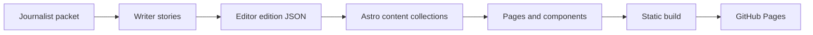

# CurrentWire

CurrentWire is a streaming morning news site. It files the stories worth following, and the questions worth carrying into the day.

The public name is **CurrentWire**. The line under the masthead stays fixed:

> For the stories worth following, and the questions worth carrying into the day.

Each morning is one edition, dated in India Standard Time (`Asia/Calcutta`). The front leads with a Top Picks ladder, then section hubs in desk order. A live wire sits under the masthead for the items still moving.

## Architecture

Journalist packets become writer stories. An editor lays out the morning in an edition file. Astro turns those files into pages, and GitHub Pages serves the static build.



| Stage | Where it lives |
| --- | --- |
| Writer stories | `src/content/stories/*.md` |
| Section hubs | `src/content/sections/*.json` |
| Editor edition | `src/data/editions/edition-YYYY-MM-DD.json` |
| Images | `public/images/` |
| Collection schema | `src/content/config.ts` |
| Page assembly | `src/lib/site.ts`, `src/pages/`, `src/components/` |
| Static output | `dist/` |
| Publish | `.github/workflows/deploy-pages.yml` |

Stories and section files are Astro content collections. The edition JSON is imported directly. It is the layout for one morning, not a collection entry.

## Where to place content

### Stories

Put one markdown file per story in `src/content/stories/`. The filename is the slug: `google-csam-report-india.md` is served at `/story/google-csam-report-india/`.

YAML frontmatter is validated by `src/content/config.ts`. The body under the closing `---` is the article.

| Field | Required | Role |
| --- | --- | --- |
| `title` | yes | Headline |
| `subtitle` | yes | Deck under the headline |
| `section` | yes | Section slug, such as `india` or `cybersecurity` |
| `slug` | yes | Same string as the filename, without `.md` |
| `importance` | yes | Integer. Higher sorts forward inside a hub when timestamps tie |
| `tags` | no | Topic tags, plus status tags `NEW`, `DEVELOPING`, `CONTINUING UPDATE` |
| `top_picks` | no | `true` when this story is on the morning ladder. The edition JSON still decides order |
| `first_filed_ist` | yes | First filing, `YYYY-MM-DD h:mm AM IST` or `PM` |
| `last_updated_ist` | yes | Latest update, same stamp format |
| `aeo_summary` | yes | Short answer-style summary kept with the story |
| `seo_title` | yes | Document title |
| `meta_description` | yes | Meta description |
| `sources` | yes | List of `{ name, url }`. `http` and `https` URLs become links |
| `image` | no | Path under `public/`, such as `images/india-women-cricket.jpg` |
| `image_alt` | no | Alt text when `image` is set |
| `image_credit` | no | Caption under the image |
| `story_type` | yes | `primary` or `secondary` |

```yaml
---
title: "Example headline"
subtitle: "The deck in one sentence."
section: "india"
slug: "example-headline"
importance: 4
tags:
  - "NEW"
  - "Courts"
top_picks: false
first_filed_ist: "2026-09-22 9:18 AM IST"
last_updated_ist: "2026-09-22 9:18 AM IST"
aeo_summary: "One paragraph a reader can use as the answer."
seo_title: "Example headline"
meta_description: "One sentence for search and social previews."
sources:
  - name: "Reuters"
    url: "https://www.reuters.com/example"
story_type: "primary"
---

The article starts here.
```

A build fails if an edition slug does not match a story file. Keep `slug`, the filename, and any edition reference identical.

### Section hubs

One JSON file per desk in `src/content/sections/`. The filename matches `slug`.

| Field | Role |
| --- | --- |
| `title` | Hub heading, in ink, not accent red |
| `slug` | Used in `/section/[slug]/` and in story `section` |
| `order` | Fallback order if a slug is missing from the edition |
| `blurb` | One line on the section page, and on an empty hub |

Current slugs, in morning order: `india`, `maharashtra`, `mmr`, `neighbours`, `united-states`, `russia-china`, `eu-uk`, `apac`, `anz`, `middle-east`, `india-finance`, `global-finance`, `science-math`, `general-tech`, `ai-ml`, `cybersecurity`, `football`, `cricket`, `other-sports`.

A section with no stories still has a page. The home page skips empty hubs.

### Edition JSON

One file per morning:

`src/data/editions/edition-YYYY-MM-DD.json`

`src/lib/site.ts` loads these files and treats the newest `date` as the live front. Archive pages cover that date and the six days before it. A day with no file renders an empty state.

| Field | Role |
| --- | --- |
| `date` | `YYYY-MM-DD`. Must match the filename |
| `label` | Human date, such as `Tuesday, 22 September 2026` |
| `timezone` | `Asia/Calcutta` |
| `kicker` | Masthead label, usually `Morning front` |
| `last_updated_ist` | Page-level stamp for the front, section pages, about, and that day's archive. Format `YYYY-MM-DD h:mm AM IST` |
| `top_picks.middle` | Story slugs for the middle stack. The first slug is the hero. The next slugs sit beside it. Aim for 3 or 4 |
| `top_picks.rail` | Story slugs for the right rail. Aim for 3 or 4. Middle plus rail stays within 7 |
| `hub_order` | Section slugs in desk order. Empty sections are skipped on the home page |
| `live_wire` | Short strings joined on the front with a middot |

`top_picks` slugs are the source of truth for the ladder. Order in the arrays is the order on the page.

```json
{
  "date": "2026-09-22",
  "label": "Tuesday, 22 September 2026",
  "timezone": "Asia/Calcutta",
  "last_updated_ist": "2026-09-22 10:14 AM IST",
  "kicker": "Morning front",
  "top_picks": {
    "middle": ["story-slug-hero", "story-slug-two", "story-slug-three"],
    "rail": ["story-slug-four", "story-slug-five", "story-slug-six", "story-slug-seven"]
  },
  "hub_order": ["india", "maharashtra", "mmr"],
  "live_wire": ["One moving item", "Another moving item"]
}
```

To add a morning: drop in the JSON, add or update the story files it names, and set `last_updated_ist` to the latest filing. Register the new file beside the existing import in `src/lib/site.ts` so the static build can see it.

### Images

Place files in `public/images/`. The logo is `public/images/logo.png`. Story art is optional. Point `image` at the public path without a leading slash (`images/photo.jpg`). Astro copies `public/` into the site root, and the base path is prefixed at build time.

## How a page is built

1. `src/pages/index.astro` asks `latestEdition()` for the newest edition JSON.
2. `EditionFront` reads `top_picks.middle` and `top_picks.rail`, then resolves each slug in the stories collection.
3. `TopPicks` paints the ladder: the first middle story is the hero, the rest of the middle is the pair beside it, and the rail is the right column.
4. Section hubs follow `hub_order`. Stories in a hub share that section slug. They sort by `last_updated_ist`, then `importance`, then `primary` before `secondary`. One to three stories keep the first as the hero and the rest on the rail. Four or more use three in the middle and the remainder on the rail.
5. `src/pages/story/[slug].astro` builds one page per story, renders the markdown, lists sources, and shows first filed and last updated.
6. `src/pages/section/[slug].astro` builds one page per section file, including empty desks.
7. `src/pages/archive/[date].astro` builds the seven-day strip. Today on the home page links to the front. Other days link to `/archive/YYYY-MM-DD/`.

`BaseLayout` wraps every page with the masthead, theme toggle, footer, and the page-level IST stamp.

### Theme

The toggle is System, Light, and Dark. A small script in `BaseLayout` reads `localStorage` key `cw-theme` before paint and sets `data-theme` on `<html>`. Choosing a theme stores that value and sets a new random `--grad-angle`.

Colours live as CSS variables in `src/styles/global.css`. Light runs light blue, cream, and light red. Dark stays in navy, indigo, and plum. The ladder collapses to one column near 640px.

### IST timestamps

Stamps are strings, not Date objects: `2026-09-22 10:14 AM IST`. `formatIst()` prints them as `22 Sep 2026, 10:14 AM IST`.

The bar at the top is the page-level last updated time. On the front, section hubs, about, and an archive day that has an edition, that value is the edition's `last_updated_ist`. On a story, the bar uses that story's `last_updated_ist`, and the article also shows `first_filed_ist`.

## Local development

Requires Node.js 22 or newer, and npm.

```bash
npm install
npm run dev
```

Dev defaults to base path `/` and serves the local preview with hot reload.

```bash
npm run build
npm run preview
```

`npm run build` writes the static site to `dist/`. `npm run preview` serves that folder.

A local build uses base `/`. To preview the project-site paths used in production:

```bash
BASE_PATH=/currentwire SITE=https://ojaashampiholi.github.io npm run build
npm run preview
```

## Deployment

The site is static Astro (`output: 'static'` in `astro.config.mjs`). There is no server adapter.

GitHub Actions publishes it. [`.github/workflows/deploy-pages.yml`](.github/workflows/deploy-pages.yml) runs on every push to `main`, and it can be started by hand. The workflow installs with `npm ci`, builds with `BASE_PATH=/currentwire` and `SITE=https://ojaashampiholi.github.io`, uploads `dist/`, and deploys to GitHub Pages.

The live site is [https://ojaashampiholi.github.io/currentwire/](https://ojaashampiholi.github.io/currentwire/).

In the repository settings, **Pages → Source** should be **GitHub Actions**. `trailingSlash` is `always`, so public URLs end with `/`.

A custom domain can be added later from the Pages settings. For a host that serves the site from `/`, build without `BASE_PATH`.

## Credit

Built and maintained by **Ojaas Hampiholi**.

Companion project: [The Cosmic Notebook](https://ojaashampiholi.github.io/the-cosmic-notebook/).
